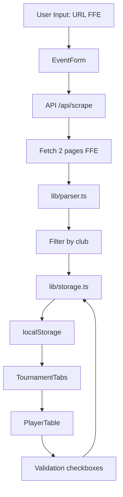

# 🤝 Contributing to Hay Chess Tracker

Merci de votre intérêt pour contribuer à Hay Chess Tracker ! Ce document vous guidera à travers le processus de contribution.

---

## 📋 Table des Matières

- [Code of Conduct](#code-of-conduct)
- [Comment contribuer](#comment-contribuer)
- [Setup développement](#setup-développement)
- [Standards de code](#standards-de-code)
- [Convention commits](#convention-commits)
- [Processus Pull Request](#processus-pull-request)
- [Architecture projet](#architecture-projet)
- [Tests](#tests)
- [Style guide UI](#style-guide-ui)

---

## Code of Conduct

En participant à ce projet, vous acceptez de maintenir un environnement respectueux et inclusif. Soyez courtois, constructif et professionnel dans toutes vos interactions.

---

## Comment contribuer

### Types de contributions

Nous accueillons plusieurs types de contributions :

1. **Bug fixes** - Corriger des bugs existants
2. **Features** - Ajouter de nouvelles fonctionnalités
3. **Documentation** - Améliorer la documentation
4. **Tests** - Ajouter ou améliorer les tests
5. **Performance** - Optimisations de performance
6. **Accessibilité** - Améliorations a11y

### Avant de commencer

1. **Recherchez les issues existantes** - Vérifiez si votre idée/bug n'est pas déjà en discussion
2. **Créez une issue** - Décrivez votre proposition avant de coder (pour les features importantes)
3. **Attendez feedback** - Pour les changements majeurs, attendez validation de l'équipe
4. **Forkez le repo** - Travaillez sur votre fork, pas directement sur master

---

## Setup développement

### Prérequis

```bash
Node.js >= 20.x
npm >= 10.x
Git >= 2.x
```

### Installation

```bash
# 1. Forker le repository sur GitHub
# 2. Cloner votre fork
git clone https://github.com/YOUR_USERNAME/hay-chess-tracker.git
cd hay-chess-tracker

# 3. Ajouter le remote upstream
git remote add upstream https://github.com/hay-chess/hay-chess-tracker.git

# 4. Installer les dépendances
npm install

# 5. Créer une branche pour votre feature
git checkout -b feat/ma-nouvelle-feature

# 6. Lancer le serveur de développement
npm run dev
```

L'application sera disponible sur `http://localhost:5173`

### Commandes disponibles

```bash
# Développement
npm run dev              # Démarrer le serveur de dev (port 5173)
npm run build            # Build production
npm run preview          # Preview du build

# Code quality
npm run lint             # Linter ESLint
npm run format           # Formater avec Prettier

# Tests
npm test                 # Lancer les tests (mode watch)
npm run test:ui          # Interface UI pour tests
npm run test:coverage    # Générer rapport coverage
npm run test:ci          # Tests en mode CI (single run)

# Utilitaires
npm run check-coverage   # Vérifier coverage >= 70%
npm run release          # Créer une nouvelle release
```

---

## Standards de code

### TypeScript Strict

Le projet utilise **TypeScript strict mode** activé. Tous les fichiers doivent :

- ✅ Typer explicitement les paramètres et retours de fonction
- ✅ Éviter `any` (utiliser `unknown` si nécessaire)
- ✅ Utiliser les types génériques appropriés
- ✅ Définir les interfaces pour les objets complexes

```typescript
// ❌ BAD
function parsePlayer(data: any) {
  return data.name;
}

// ✅ GOOD
interface PlayerData {
  name: string;
  elo: number;
}

function parsePlayer(data: PlayerData): string {
  return data.name;
}
```

### ESLint Configuration

Le projet utilise ESLint avec les règles suivantes :

- `@typescript-eslint/recommended`
- `react-hooks/recommended`
- `react/recommended`

**Lancer le linter :**
```bash
npm run lint
```

**Auto-fix :**
```bash
npm run lint -- --fix
```

### Prettier Configuration

Le code doit être formaté avec Prettier :

```json
{
  "semi": true,
  "trailingComma": "es5",
  "singleQuote": true,
  "printWidth": 100,
  "tabWidth": 2
}
```

**Formater le code :**
```bash
npm run format
```

**Configuration IDE recommandée :**
- VS Code : Installer l'extension Prettier + Format on Save
- WebStorm : Enable Prettier + Reformat on Save

---

## Convention commits

Nous suivons **Conventional Commits** pour maintenir un historique Git clair et générer automatiquement le CHANGELOG.

### Format obligatoire

```
TYPE(scope): description concise en minuscules

- Détail 1 (si nécessaire)
- Détail 2

🤖 Generated with [Claude Code](https://claude.com/claude-code)

Co-Authored-By: Claude <noreply@anthropic.com>
```

### Types valides

| Type | Description | Exemple |
|------|-------------|---------|
| `feat` | Nouvelle fonctionnalité | `feat(parser): add support for exempt players` |
| `fix` | Correction de bug | `fix(storage): handle localStorage quota errors` |
| `docs` | Documentation uniquement | `docs(readme): update installation steps` |
| `style` | Changements cosmétiques (whitespace, formatting) | `style(button): adjust padding` |
| `refactor` | Refactoring sans changement de comportement | `refactor(parser): simplify parseRoundResult logic` |
| `perf` | Amélioration de performance | `perf(table): virtualize long player lists` |
| `test` | Ajout/modification de tests | `test(parser): add unit tests for parseElo` |
| `chore` | Tâches de maintenance | `chore(deps): update vite to 5.4.2` |
| `ci` | Configuration CI/CD | `ci(workflows): add deploy-preview job` |
| `build` | Système de build | `build(vite): configure bundle analyzer` |

### Scopes recommandés

- `parser` - Parsing FFE
- `storage` - localStorage management
- `api` - API proxy Vercel
- `ui` - Composants UI
- `docs` - Documentation
- `deps` - Dépendances
- `config` - Configuration

### Exemples de commits

```bash
# Feature
git commit -m "feat(parser): add support for performance calculation"

# Bug fix
git commit -m "fix(storage): prevent crash when localStorage is full"

# Documentation
git commit -m "docs(api): document scrape endpoint parameters"

# Breaking change
git commit -m "feat(api): change scrape endpoint to POST method

BREAKING CHANGE: The /api/scrape endpoint now only accepts POST requests"
```

### Pre-commit hooks

Le projet utilise **Husky** pour vérifier automatiquement :

- ✅ Tests passent
- ✅ Linter passe
- ✅ Coverage >= 70%
- ✅ Format commit valide

Si ces checks échouent, le commit est bloqué.

---

## Processus Pull Request

### Avant de soumettre

1. **Synchroniser avec upstream**
   ```bash
   git fetch upstream
   git rebase upstream/master
   ```

2. **Vérifier que tout passe**
   ```bash
   npm run lint       # ESLint
   npm test           # Tests
   npm run build      # Build
   ```

3. **Vérifier coverage**
   ```bash
   npm run test:coverage
   # Coverage doit être >= 70%
   ```

### Soumettre la PR

1. **Push sur votre fork**
   ```bash
   git push origin feat/ma-nouvelle-feature
   ```

2. **Créer la PR sur GitHub**
   - Utiliser le template PR fourni
   - Remplir TOUTES les sections
   - Lier les issues concernées (`Closes #123`)
   - Ajouter screenshots si changement UI

3. **Attendre review**
   - Au moins 1 approbation requise
   - Tous les checks CI doivent passer
   - Pas de conflits avec master

### Checklist PR

Votre PR doit cocher toutes ces cases :

- [ ] Tests ajoutés/mis à jour
- [ ] Documentation mise à jour
- [ ] Commits suivent la convention
- [ ] ESLint passe (0 erreurs)
- [ ] Tests passent (100%)
- [ ] Coverage >= 70%
- [ ] Build passe
- [ ] Pas de console.log ou debugger
- [ ] TypeScript strict (pas de `any`)
- [ ] Accessibilité vérifiée (si UI)
- [ ] Responsive testé (si UI)

### Process de review

1. **Reviewer assigne** - Un maintainer sera assigné
2. **Review code** - Feedback dans les 48h
3. **Corrections demandées** - Faire les modifications
4. **Approbation** - Quand tout est OK
5. **Merge** - Squash merge sur master par maintainer
6. **Deploy automatique** - Vercel déploie automatiquement

### Après le merge

- Votre branche sera supprimée automatiquement
- Votre contribution apparaîtra dans le prochain CHANGELOG
- Vous serez crédité dans les release notes

---

## Architecture projet

### Structure des dossiers

```
hay-chess-tracker/
├── src/
│   ├── components/           # Composants React
│   │   ├── ui/              # shadcn/ui primitives
│   │   │   ├── button.tsx
│   │   │   ├── card.tsx
│   │   │   └── ...
│   │   ├── common/          # Composants Miami réutilisables
│   │   │   ├── MiamiGlass.tsx
│   │   │   ├── ShimmerEffect.tsx
│   │   │   └── FloatingParticles.tsx
│   │   ├── EventForm.tsx    # Features
│   │   ├── TournamentTabs.tsx
│   │   ├── PlayerTable.tsx
│   │   └── ClubStats.tsx
│   ├── lib/                 # Core logic (BUSINESS CRITICAL)
│   │   ├── parser.ts        # Parser FFE (2 pages)
│   │   ├── storage.ts       # localStorage management
│   │   └── utils.ts         # Utilitaires
│   ├── types/
│   │   └── index.ts         # Types TypeScript globaux
│   ├── styles/
│   │   └── globals.css      # Styles Miami
│   ├── test/
│   │   └── setup.ts         # Configuration tests
│   ├── App.tsx              # Composant racine
│   └── main.tsx             # Entry point
├── api/
│   └── scrape.ts            # Vercel Function (proxy CORS)
├── docs/                    # Documentation
│   ├── API.md
│   ├── ARCHITECTURE.md
│   ├── DEPLOYMENT.md
│   └── SECURITY.md
├── scripts/                 # Scripts utilitaires
│   ├── pre-commit.sh
│   ├── check-coverage.sh
│   ├── release.sh
│   └── setup-dev.sh
└── .github/
    ├── workflows/           # GitHub Actions
    └── ISSUE_TEMPLATE/      # Templates issues
```

### Principes architecturaux

1. **Separation of Concerns**
   - `lib/` : Logique métier pure (testable isolément)
   - `components/` : Présentation UI (React)
   - `api/` : Backend serverless (Vercel Functions)

2. **Single Responsibility**
   - Chaque fichier/fonction a une responsabilité unique
   - Parser FFE : `lib/parser.ts` uniquement
   - Storage : `lib/storage.ts` uniquement

3. **Dependency Injection**
   - Pas de dépendances hardcodées
   - Props drilling évité (Context API si nécessaire)

4. **Immutabilité**
   - Pas de mutations d'état directes
   - Utiliser spread operator ou structuredClone

### Flux de données



---

## Tests

### Stratégie de test

Le projet vise **80%+ de couverture** avec 3 niveaux de tests :

#### 1. Tests unitaires (Vitest)

Tester chaque fonction isolément.

**Fichiers :**
- `src/lib/parser.test.ts`
- `src/lib/storage.test.ts`
- `src/lib/utils.test.ts`

**Exemple :**

```typescript
import { describe, it, expect } from 'vitest';
import { parseElo } from '@/lib/parser';

describe('parseElo', () => {
  it('should parse numeric ELO', () => {
    expect(parseElo('1541 F')).toBe(1541);
  });

  it('should return 0 for invalid input', () => {
    expect(parseElo('N/A')).toBe(0);
  });
});
```

#### 2. Tests d'intégration (React Testing Library)

Tester les composants avec leurs dépendances.

**Fichiers :**
- `src/components/EventForm.test.tsx`
- `src/components/PlayerTable.test.tsx`

**Exemple :**

```typescript
import { render, screen, fireEvent } from '@testing-library/react';
import { describe, it, expect, vi } from 'vitest';
import EventForm from '@/components/EventForm';

describe('EventForm', () => {
  it('should submit form with valid data', async () => {
    const onSubmit = vi.fn();
    render(<EventForm onSubmit={onSubmit} />);

    fireEvent.change(screen.getByLabelText('Event Name'), {
      target: { value: 'Test Event' }
    });
    fireEvent.click(screen.getByText('Create Event'));

    expect(onSubmit).toHaveBeenCalledWith(
      expect.objectContaining({ name: 'Test Event' })
    );
  });
});
```

#### 3. Tests E2E (Playwright)

Tester les scénarios utilisateur complets.

**Fichiers :**
- `e2e/create-event.spec.ts`
- `e2e/validate-results.spec.ts`

**Exemple :**

```typescript
import { test, expect } from '@playwright/test';

test('should create new event and fetch results', async ({ page }) => {
  await page.goto('http://localhost:5173');

  // Create event
  await page.click('text=Nouvel événement');
  await page.fill('input[name="eventName"]', 'Test Event');
  await page.click('button:text("Créer")');

  // Verify
  await expect(page.locator('h1')).toContainText('Test Event');
});
```

### Lancer les tests

```bash
# Tests en mode watch
npm test

# Tests avec coverage
npm run test:coverage

# Tests E2E
npm run test:e2e

# Tests CI (single run)
npm run test:ci
```

### Exigences coverage

- **Minimum global :** 70%
- **Objectif :** 80%
- **Core logic (`lib/`) :** 90%+

Les PRs qui réduisent le coverage sont bloquées.

---

## Style guide UI

### Design System Miami

Le projet utilise le style **Miami Vice glassmorphism**.

#### Couleurs

```css
/* Primary colors */
--miami-aqua: #008E97;      /* Turquoise vibrant */
--miami-orange: #FC4F00;    /* Orange flamboyant */
--miami-navy: #013369;      /* Bleu marine profond */

/* Gradient */
--miami-gradient: linear-gradient(135deg, #008E97 0%, #FC4F00 100%);

/* Glassmorphism */
--glass-bg: rgba(255, 255, 255, 0.1);
--glass-border: rgba(255, 255, 255, 0.2);
--glass-blur: blur(15px);
```

#### Composants Miami

Utiliser les composants `common/` pour maintenir la cohérence :

```tsx
import MiamiGlass from '@/components/common/MiamiGlass';
import ShimmerEffect from '@/components/common/ShimmerEffect';
import FloatingParticles from '@/components/common/FloatingParticles';

function MyComponent() {
  return (
    <MiamiGlass variant="card">
      <ShimmerEffect />
      <FloatingParticles count={20} />
      <h2>Mon contenu</h2>
    </MiamiGlass>
  );
}
```

#### Effets visuels

- **Glassmorphism** : `backdrop-filter: blur(15px)` + transparence
- **Shimmer** : Animation subtile sur hover
- **Floating Particles** : Canvas particles en arrière-plan
- **Smooth transitions** : `transition: all 0.3s ease`

#### Responsive

Mobile-first approach avec breakpoints Tailwind :

```css
sm: 640px   /* Mobile landscape */
md: 768px   /* Tablet portrait */
lg: 1024px  /* Tablet landscape */
xl: 1280px  /* Desktop */
2xl: 1536px /* Large desktop */
```

#### Accessibilité UI

- **Contraste minimum** : 4.5:1 pour texte normal, 3:1 pour large
- **Focus visible** : `focus:ring-2 focus:ring-miami-aqua`
- **Touch targets** : Minimum 44x44px
- **Keyboard navigation** : Tab order logique
- **ARIA labels** : Sur tous les éléments interactifs

**Vérifier accessibilité :**
```bash
# Lighthouse audit
npm run lighthouse

# axe DevTools (Chrome extension)
```

#### Performance animations

- Utiliser `transform` et `opacity` (GPU-accelerated)
- Éviter `width`, `height`, `top`, `left` (reflow)
- Utiliser `will-change` avec parcimonie
- 60 FPS minimum

```css
/* ❌ BAD */
.element {
  transition: width 0.3s;
}

/* ✅ GOOD */
.element {
  transition: transform 0.3s;
  transform: scaleX(1);
}
```

---

## Questions & Support

### Obtenir de l'aide

- **Documentation** : Lire les docs dans `/docs`
- **Issues** : Rechercher dans les [issues existantes](https://github.com/hay-chess/hay-chess-tracker/issues)
- **Discussions** : Poser une question dans [Discussions](https://github.com/hay-chess/hay-chess-tracker/discussions)
- **Email** : Contacter l'équipe technique

### Ressources utiles

- [React Documentation](https://react.dev)
- [TypeScript Handbook](https://www.typescriptlang.org/docs/)
- [Vite Guide](https://vitejs.dev/guide/)
- [Tailwind CSS Docs](https://tailwindcss.com/docs)
- [Vitest Documentation](https://vitest.dev)
- [Conventional Commits](https://www.conventionalcommits.org)

---

## Remerciements

Merci à tous les contributeurs qui rendent ce projet possible ! Vos contributions, grandes ou petites, sont précieuses.

**Contributors Hall of Fame** sera maintenu dans le README principal.

---

**Dernière mise à jour :** 30 octobre 2025
**Maintenu par :** Équipe Hay Chess Tracker
