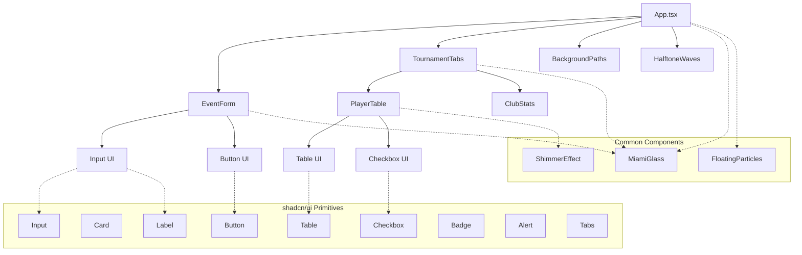
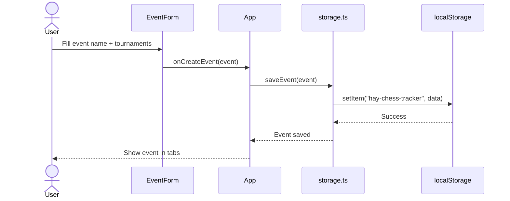
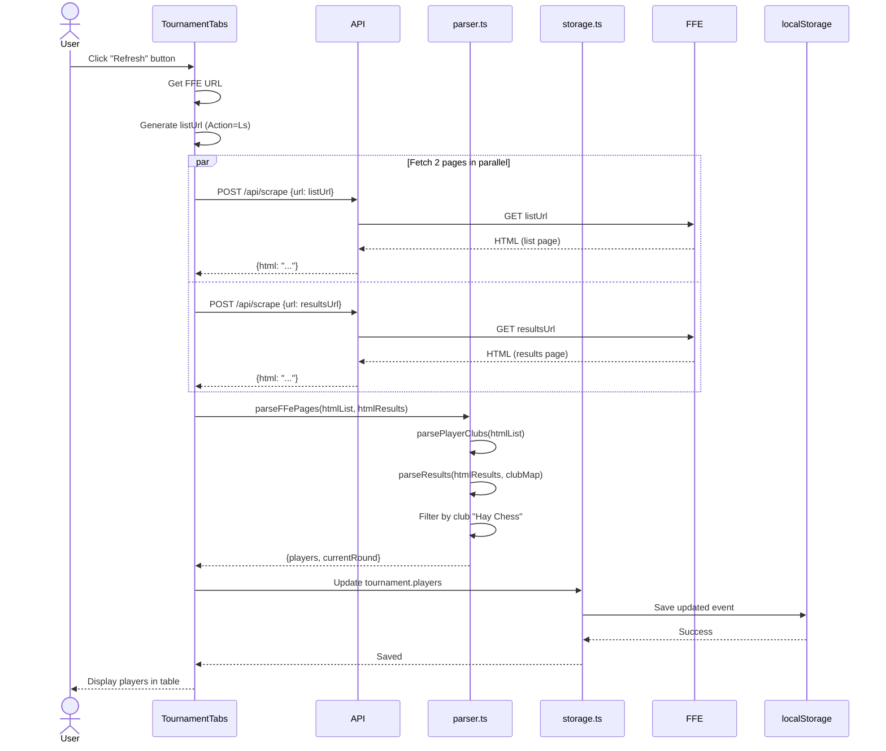
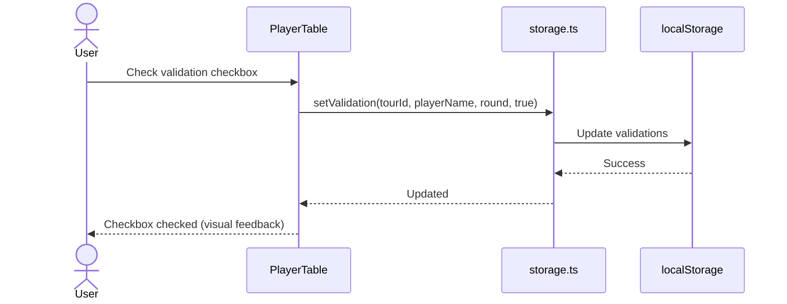
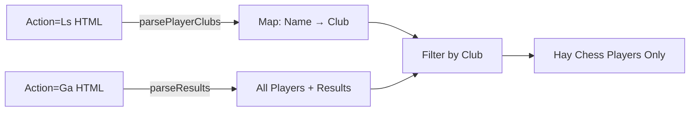
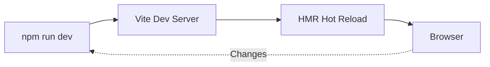
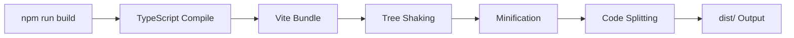
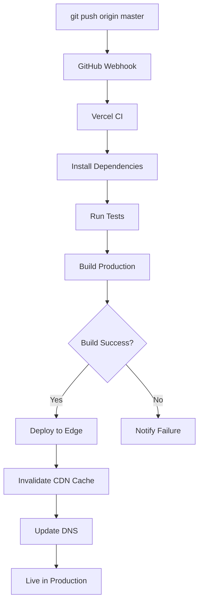
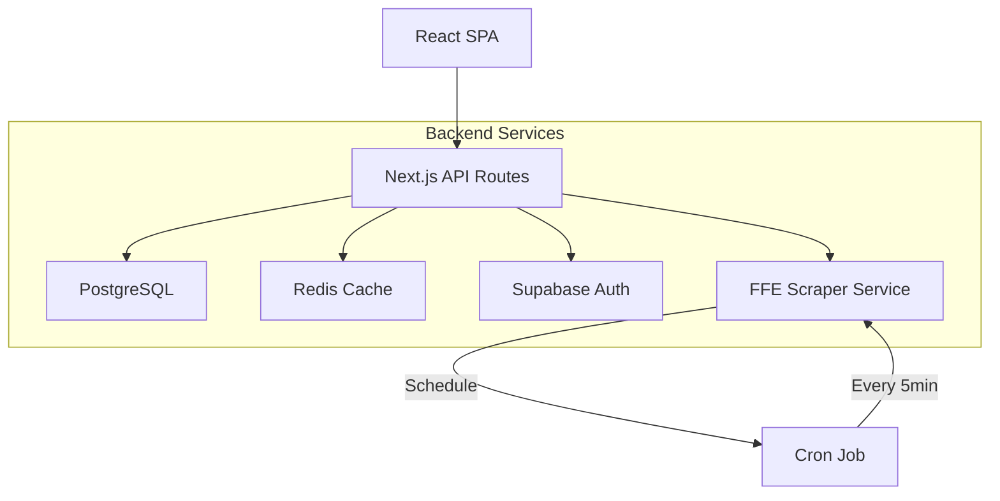

# Architecture Documentation

Technical architecture documentation for Hay Chess Tracker.

---

## Table of Contents

- [High-Level Overview](#high-level-overview)
- [System Architecture](#system-architecture)
- [Component Tree](#component-tree)
- [Data Flow](#data-flow)
- [FFE Parser Architecture](#ffe-parser-architecture)
- [localStorage Structure](#localstorage-structure)
- [API Architecture](#api-architecture)
- [Build & Deployment Pipeline](#build--deployment-pipeline)
- [Technology Stack](#technology-stack)
- [Performance Considerations](#performance-considerations)

---

## High-Level Overview

Hay Chess Tracker is a **client-side SPA (Single Page Application)** built with React and TypeScript, with a **serverless backend** for CORS proxy functionality.

**Key Characteristics:**

- **Frontend:** React 18 + TypeScript + Vite
- **Backend:** Vercel Serverless Functions (Node.js 20)
- **Storage:** Browser localStorage (no database)
- **Deployment:** Vercel Edge Network (global CDN)
- **State Management:** React hooks + localStorage
- **Styling:** Tailwind CSS + custom Miami theme

**Architecture Pattern:** **Jamstack** (JavaScript, APIs, Markup)

---

## System Architecture

```mermaid
graph TB
    subgraph "Client Browser"
        A[React SPA]
        B[localStorage]
        C[Service Worker]
    end

    subgraph "Vercel Edge Network"
        D[Static Assets CDN]
        E[/api/scrape Function]
    end

    subgraph "External Services"
        F[FFE Tournament Pages]
    end

    A -->|Read/Write| B
    A -->|Fetch| D
    A -->|POST /api/scrape| E
    E -->|HTTP GET| F
    F -->|HTML Response| E
    E -->|JSON Response| A
    D -->|Serve| A
    C -.->|Cache| D
```

**Flow:**

1. User opens app → Vercel CDN serves static HTML/CSS/JS
2. React app loads → Reads data from localStorage
3. User creates event with FFE URL → React calls `/api/scrape`
4. `/api/scrape` function fetches FFE pages → Returns HTML
5. React parses HTML → Filters club players → Saves to localStorage
6. User validates results → Updates localStorage

---

## Component Tree



**Component Hierarchy:**

- **App.tsx** - Root component, manages global state
  - **EventForm** - Create/edit events and tournaments
  - **TournamentTabs** - Tab navigation between tournaments
    - **PlayerTable** - Display and validate player results
    - **ClubStats** - Show aggregated statistics
  - **BackgroundPaths** - SVG animated paths (Framer Motion)
  - **HalftoneWaves** - WebGL halftone waves effect

**Common Components:**
- **MiamiGlass** - Glassmorphism wrapper (backdrop-blur)
- **ShimmerEffect** - Subtle shimmer animation
- **FloatingParticles** - Canvas-based particle system

**UI Primitives (shadcn/ui):**
- Button, Card, Table, Checkbox, Input, Label, Badge, Alert, Tabs

---

## Data Flow

### 1. Event Creation Flow



### 2. Scraping & Parsing Flow



### 3. Validation Flow



---

## FFE Parser Architecture

The FFE parser is the core logic that extracts tournament data from HTML.

### Why 2 Pages?

FFE provides 2 different views:

1. **Action=Ls** (List) - Player list with **club names**
2. **Action=Ga** (Grid) - Results grid **without club names**

Neither page alone has complete information, so we must fetch **both** and cross-reference.

### Parsing Strategy



**Algorithm:**

1. **Parse Action=Ls** → Extract `Map<playerName, clubName>`
2. **Parse Action=Ga** → Extract all players with results
3. **Cross-reference** → Look up club for each player
4. **Filter** → Keep only players where `club === "Hay Chess"`
5. **Detect round** → Find max round number from results
6. **Return** → `{ players, currentRound }`

### HTML Structure Expected

**Action=Ls (List Page):**

```html
<table>
  <tr>
    <td>1</td>               <!-- Rank -->
    <td>BACHKAT Fares</td>   <!-- Name -->
    <td>1541 F</td>          <!-- ELO -->
    <td>...</td>
    <td>...</td>
    <td>...</td>
    <td>Hay Chess</td>       <!-- Club -->
  </tr>
  <!-- More rows -->
</table>
```

**Action=Ga (Results Grid):**

```html
<table>
  <thead>
    <tr>
      <th>Rg</th>
      <th>Nom</th>
      <th>Elo</th>
      <th>R 1</th>  <!-- Round columns -->
      <th>R 2</th>
      <th>R 3</th>
      <th>Pts</th>
      <th>Tr.</th>  <!-- Buchholz -->
      <th>Perf</th>
    </tr>
  </thead>
  <tbody>
    <tr>
      <td>1</td>
      <td>BACHKAT Fares</td>
      <td>1541 F</td>
      <td>+ 75B</td>  <!-- Win against #75 with White -->
      <td>= 6N</td>   <!-- Draw against #6 with Black -->
      <td>- 2B</td>   <!-- Loss against #2 with White -->
      <td>1½</td>
      <td>12.5</td>
      <td>1450</td>
    </tr>
  </tbody>
</table>
```

### Round Result Parsing

Cell text format: `[+/-/=] [opponent][B/N]`

- `+` = Win (1 point)
- `-` = Loss (0 points)
- `=` = Draw (0.5 points)
- `B` = White pieces (Blancs)
- `N` = Black pieces (Noirs)

Special cases:
- `EXE` = Exempt/Bye (1 point)
- `> 91B` = Forfeit win (1 point)
- `-` = No match (null)

**Parsing Logic:**

```typescript
function parseRoundResult(cellText: string, round: number): Result | null {
  if (!cellText || cellText === '-') return null;

  // Exempt/Bye
  if (cellText === 'EXE' || cellText.startsWith('>')) {
    return { round, score: 1, opponent: 'EXEMPT' };
  }

  // Match: [+/-/=] [num][B/N]
  const match = cellText.match(/^([+\-=])\s*(\d+)([BN])?$/);
  if (!match) return null;

  const [, result, opponentNum] = match;

  let score: 0 | 0.5 | 1;
  if (result === '+') score = 1;
  else if (result === '-') score = 0;
  else score = 0.5;

  return { round, score, opponent: opponentNum };
}
```

---

## localStorage Structure

### Storage Key

`hay-chess-tracker` (single key for all data)

### Data Schema

```typescript
{
  "currentEventId": "evt_1698765432000",
  "events": [
    {
      "id": "evt_1698765432000",
      "name": "Championnat départemental 13 - Oct 2025",
      "createdAt": "2025-10-30T12:00:00.000Z",
      "tournaments": [
        {
          "id": "tour_1698765432001",
          "name": "U12",
          "url": "https://echecs.asso.fr/...&Action=Ga",
          "lastUpdate": "2025-10-30T12:05:00.000Z",
          "players": [
            {
              "name": "BACHKAT FARES",
              "elo": 1541,
              "club": "Hay Chess",
              "ranking": 3,
              "results": [
                { "round": 1, "score": 1, "opponent": "75" },
                { "round": 2, "score": 0.5, "opponent": "6" }
              ],
              "currentPoints": 1.5,
              "buchholz": 12.5,
              "performance": 1450,
              "validated": [false, true]
            }
          ]
        }
      ]
    }
  ],
  "validations": {
    "tour_1698765432001": {
      "BACHKAT FARES": {
        "round_1": false,
        "round_2": true
      }
    }
  }
}
```

### Size Considerations

**Typical Event:**
- 1 event with 3 tournaments
- 20 players per tournament
- 7 rounds per tournament
- **Estimated size:** ~50KB

**localStorage Limit:**
- Most browsers: 5-10MB
- **Capacity:** ~100-200 events

**Mitigation:**
- Auto-delete events older than 6 months
- Implement export/import JSON
- Phase 6: Migrate to PostgreSQL

---

## API Architecture

### /api/scrape Endpoint

**Type:** Vercel Serverless Function (Node.js 20)

**Purpose:** CORS proxy to fetch FFE tournament pages

**Runtime:** Node.js 20.x (configured in Vercel)

**Timeout:** 10s (Vercel default)

**Memory:** 1024MB (Vercel default)

**Cold Start:** ~200ms

**Architecture:**

```mermaid
graph LR
    A[Client Browser] -->|POST| B[Vercel Edge]
    B --> C[/api/scrape Function]
    C -->|fetch| D[FFE Server]
    D -->|HTML| C
    C -->|JSON| B
    B -->|JSON| A
```

**Function Code Structure:**

```typescript
// api/scrape.ts
import type { VercelRequest, VercelResponse } from '@vercel/node';

export default async function handler(req: VercelRequest, res: VercelResponse) {
  // 1. Validate method (POST only)
  // 2. Extract URL from body
  // 3. Validate URL (must be echecs.asso.fr)
  // 4. Fetch FFE page with custom headers
  // 5. Return HTML as JSON
  // 6. Error handling
}
```

**Security:**

- Only accepts `echecs.asso.fr` domain
- POST method only
- No authentication (public endpoint)
- User-Agent spoofing to appear as browser

**Future Enhancements:**

- Rate limiting (10 req/min per IP)
- Caching (30s TTL for same URL)
- Retry logic with exponential backoff

---

## Build & Deployment Pipeline

### Local Development



**Port:** 5173
**HMR:** Hot Module Replacement (instant updates)
**TypeScript:** Type checking in background

### Production Build



**Output:**

```
dist/
├── index.html
├── assets/
│   ├── index-[hash].js      # Main bundle (~200KB gzipped)
│   ├── index-[hash].css     # Styles (~20KB gzipped)
│   └── vendor-[hash].js     # Dependencies (~300KB gzipped)
└── vite.svg
```

**Optimizations:**

- Tree shaking (unused code removed)
- Minification (Terser)
- Code splitting (dynamic imports)
- Asset hashing (cache busting)
- CSS purging (Tailwind)

### Deployment Flow



**Time:** 2-3 minutes from push to live

**Vercel Edge:**
- Global CDN (30+ regions)
- Automatic HTTPS (Let's Encrypt)
- Automatic compression (Brotli)
- Cache headers (1 year for assets)

---

## Technology Stack

### Frontend Stack

| Layer | Technology | Purpose |
|-------|-----------|---------|
| **Framework** | React 18 | UI library with hooks |
| **Language** | TypeScript 5.5 | Type safety |
| **Build Tool** | Vite 5.4 | Fast dev server + bundler |
| **Styling** | Tailwind CSS 3.4 | Utility-first CSS |
| **UI Components** | shadcn/ui | Accessible primitives |
| **Animations** | Framer Motion 12 | Declarative animations |
| **Icons** | Lucide React | SVG icon library |
| **Date Utils** | date-fns 3.0 | Date manipulation |
| **Class Utils** | clsx + tailwind-merge | Conditional classes |

### Backend Stack

| Layer | Technology | Purpose |
|-------|-----------|---------|
| **Runtime** | Node.js 20.x | JavaScript runtime |
| **Framework** | Vercel Functions | Serverless functions |
| **HTTP Client** | Native fetch | HTTP requests |
| **HTML Parser** | Cheerio 1.0 | jQuery-like HTML parsing |

### Development Tools

| Tool | Purpose |
|------|---------|
| **Testing** | Vitest + Testing Library | Unit & integration tests |
| **Linting** | ESLint + TypeScript ESLint | Code quality |
| **Formatting** | Prettier | Code formatting |
| **Type Checking** | TypeScript Compiler | Static analysis |
| **Git Hooks** | Husky | Pre-commit checks |
| **Coverage** | Vitest Coverage (V8) | Code coverage reports |

### Infrastructure

| Layer | Technology |
|-------|-----------|
| **Hosting** | Vercel Edge Network |
| **CDN** | Vercel Global CDN |
| **Functions** | Vercel Serverless Functions |
| **Storage** | Browser localStorage |
| **DNS** | Vercel DNS |
| **SSL** | Let's Encrypt (automatic) |
| **CI/CD** | GitHub Actions + Vercel |

---

## Performance Considerations

### Current Metrics (v1.0.0-beta)

| Metric | Value | Target |
|--------|-------|--------|
| **Bundle Size** | 581KB | < 300KB |
| **Lighthouse Performance** | ~75 | > 90 |
| **LCP** | ~3.5s | < 2.5s |
| **FID** | < 100ms | < 100ms |
| **CLS** | 0.05 | < 0.1 |
| **TTI** | ~4s | < 3s |

### Performance Bottlenecks

1. **Large Bundle** (581KB)
   - Cause: Framer Motion, Cheerio, React dependencies
   - Solution: Code splitting, lazy loading

2. **Heavy Animations**
   - HalftoneWaves (WebGL) - 50KB
   - BackgroundPaths (SVG) - 30KB
   - Solution: Lazy load, conditional rendering

3. **No Caching**
   - Every fetch hits FFE server
   - Solution: Cache API responses (30s TTL)

### Optimization Roadmap (Phase 3)

1. **Code Splitting**
   ```typescript
   const HalftoneWaves = lazy(() => import('./HalftoneWaves'));
   const BackgroundPaths = lazy(() => import('./BackgroundPaths'));
   ```

2. **Virtualization**
   - PlayerTable with 100+ rows
   - Use `@tanstack/react-virtual`

3. **Image Optimization**
   - Convert icons to WebP/AVIF
   - Lazy load images

4. **Service Worker**
   - Cache static assets
   - Offline support

---

## Future Architecture (Phase 6)

### Backend Architecture



**Changes:**

- localStorage → PostgreSQL (Supabase)
- Direct FFE fetch → Background scraper service
- No auth → JWT authentication (Supabase Auth)
- Single-user → Multi-user with permissions

---

**Last Updated:** 30 October 2025
**Maintained by:** Hay Chess Tracker Team
